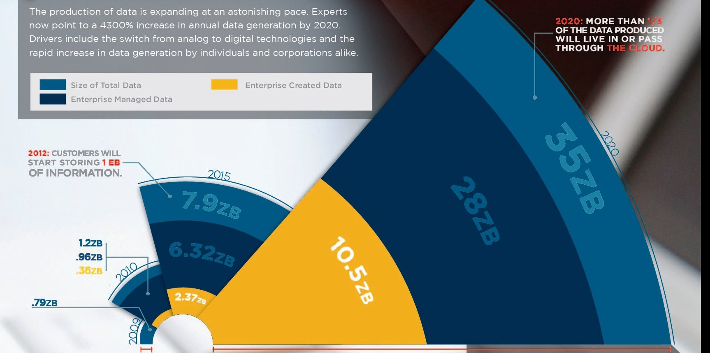
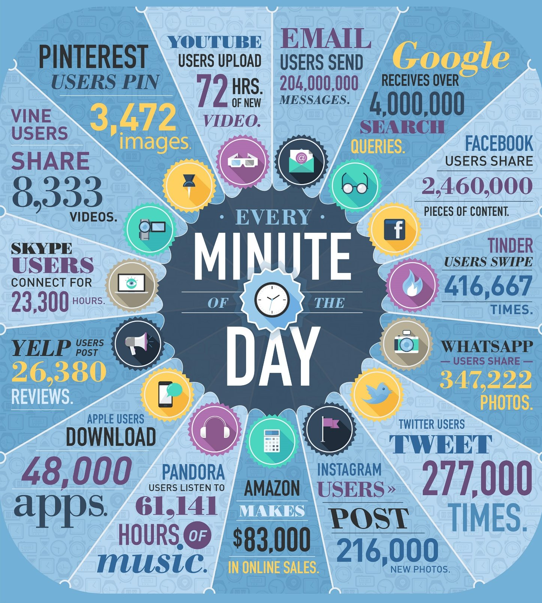

# Data Science Fundamentals

Welcome to Introduction to Data Science & Machine Learning! Before we delve into the material, I want to talk about the goals for this course.

In six weeks, you will be able to use Python to:

1. Make basic functions and programs

2. Visualize your datasets using the appropriate techniques

3. Apply statistical techniques to datasets

4. Use Machine Learning techniques to extract hidden insight

Let's get started!

## The Data Explosion

Data is being created must faster, at an exponential rate

Where is this data coming from?

Notice that the new data is different to the old kinds of 'boring' data. This new data is unstructured, not in nice tables with primary keys, and niche columns. This gives us a headache! We have a treasure trove of information, but not enough people with the skill to extract the insight we need.

[Extra Reading: Treasure trove: Big data plays crucial role in modern business strategy](http://www.scmp.com/native/tech/topics/tech-trends/article/2071109/treasure-trove-big-data-plays-crucial-role-modern)

[Extra Reading: Data Scientist: The Sexiest Job of the 21st Century](https://hbr.org/2012/10/data-scientist-the-sexiest-job-of-the-21st-century)

This is where a Data Scientist comes in. A data scientist works in an "interdisciplinary field using scientific methods, processes and systems to extract knowledge or insights from data in various forms, either structured or unstructured."

## Data Science Applications

1. Healthcare: Finding Genomes. 23 specific genes isolated from 42,000 blood samples (~ 50,000 genes per sample, ~63 billion rows)
2. Pricing illiquid instruments accurately using Ensemble Learning
3. Sentimental Analysis of news stories and public perception to drive decision making
4. Using Machine Learning techniques of millions of transactions, to create better fraud detection techniques
5. Crisis management: Improved disaster response, e.g. Nepal 2015 earthquake and Ebloa outbreak

## The Six V's of Data Science

Using a data driven approach, you can extract insight from any dataset. But there are some properties and characteristics that are crucial to Big Data. These 6 V's will help give you a bigger perspective on Data Science, and show you what people mean when they say "Big Data".

1. **Volume:** How big the dataset is. Datasets are very varied, and can go from simple CSV files (in the MBs) to Large Hadron Collider data (15 pb a year). [How 'big' is a petabyte/yottabyte? Check out this video of powers of 10 to give you some perspective!](https://www.youtube.com/watch?v=0fKBhvDjuy0)

2. **Variety:** A dataset can include very diverse data. It doesn't always have to be numeric, but can also have image data, text data, maps, sensor data etc etc.

3. **Velocity:** The increasing speed at which data is being created, and needs to be stored/analyzed. Depends on context and what you are trying to achieve!

4. **Veracity:** This refers to the quality of the data, which is defined by considering the accuracy of the data, trustworthiness of the data source, how the data was generated etc. It is very important for making big data systems operational and useful. Junk In == Junk Out!

5. **Valence:** How connected your data is. The more connected your data is, the higher the valence (comes from chemistry). Higher valence dataset is denser, and requires more advanced techniques to be made sense of.

6. **Value**: The most important V, in my opinion. Remember that there is a question you are trying to answer and a goal you are trying to achieve. Don't forget the value you are looking for, or the thing you are looking to optimize. I.e., don't lose yourself in the noise!

## Types of Data

Very important if you want to work with data. You should know how to categorize them and how to treat them differently. There are many flavours of data, and differnet techniques have different applications on different kinds of data.

1. **Numerical:** Represents quantitative measurements. E.g. heights of people, age, stock price. There are two types of numerical data too.
..* Discrete: data that can only be in integers, based on some event usually. e.g. age, number of visits
..* Continuus: data that can have any value (infinite possibilities). e.g. heights, stock price, how much snow fell yesterday etc

2. **Categorical:** data that is assigned and does not have actual mathematical meaning. You can assign numbers to categories but the number don't themselves have meaning. Usually binaries. e.g. gender, race, political affiliation etc

3. **Ordinal:** Mixture of categorical and numerical. Categorized numbers, but the numbers **DO** have meaning. e.g. Movie ratings on a scale of 5.
