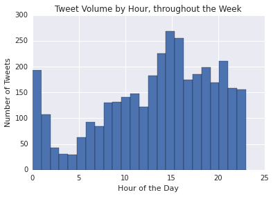
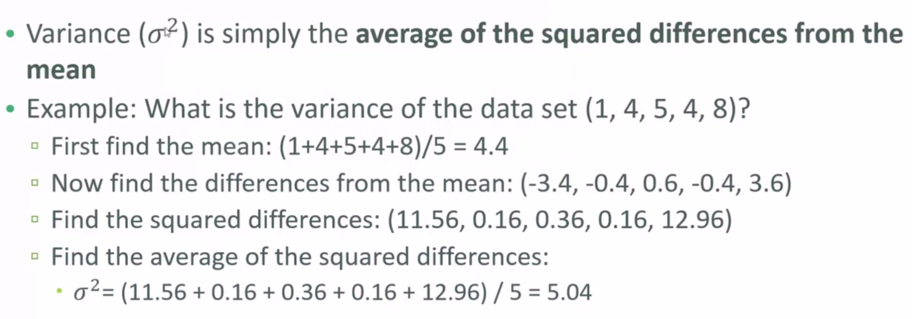
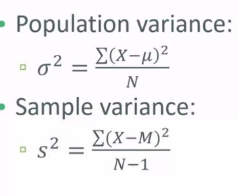
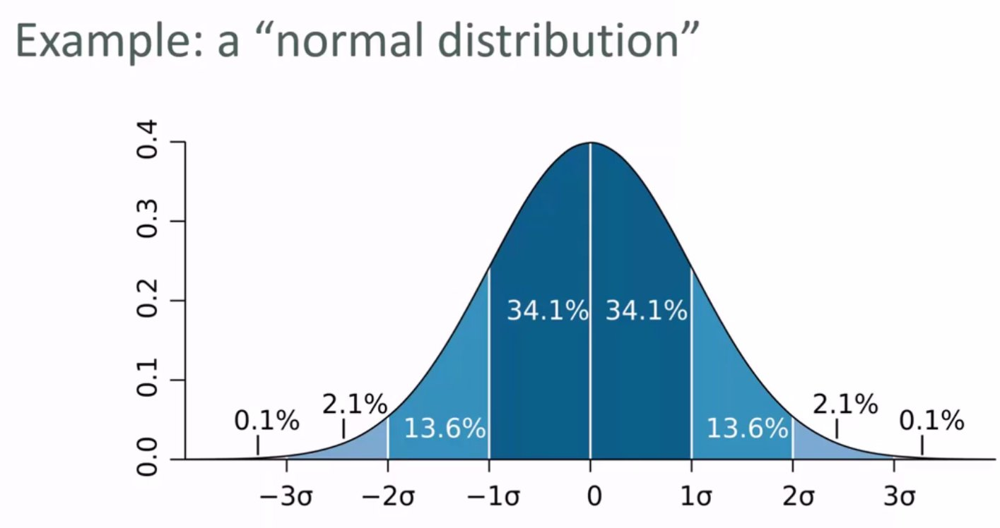
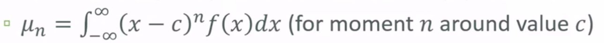

# Download
Download the notebook [here](Week1/StatswithPython.ipynb).

# Statistics with Python!

In this class, we're going to learn how to perform basic statistical operations with Python. We're going to be using a couple of different libraries, namely numpy, scipy and the Python standard library. Afterwards, we can go thorough an introduction for the Pandas library if we have time. 


At the end, we'll perform these operations on a real life dataset to get up to speed with these operations. 


```python
#Start with importing the numpy library as np

import numpy as np

incomes = np.random.normal(50000,10000,10000)
np.mean(incomes) #Very simple to compute mean, by simply calling np.mean(<<your_variable>>)
```


```python
import matplotlib.pyplot as plt
%matplotlib inline

plt.hist(incomes,50)
plt.title('Normal Distribution of Incomes')
plt.show()
```


```python
np.median(incomes) #Medians are also very easy to compute with numpy
```


```python
incomes = np.append(incomes, [1000000000]) #Append an outlier into your distrubution. What happens to the mean and mode?
```


```python
np.mean(incomes) # Always think about what outliers could do to your data, and change around the mean and the median.
```


```python
np.median(incomes)
```

## Mode

Mode is the most common value within a dataset. This is pretty easy to understand, and can be useful for smaller (read: less spaced out) datasets.

Age data is a good one to be using with mode for example, becaues you can get the most common age of a population.


```python
ages = np.random.randint(20, high=95, size=2000)
ages.std()
```


```python
from scipy import stats
stats.mode(ages)
```


## Variation & Standard Deviation

Probably something you've heard before, but let's talk about how we can use them, and what they really are. 
A loose definition: they measure the 'spread' of a data distribution.

Variance and Standard Distributions are about the spread of the distribution, or the dataset. 



How do you calculate variance?


And Standard Deviaton? That's just the square root of sigma squared (== sigma). 

How many sigmas from the mean is it? 


### Population vs Sample Differences

Technical mathematical difference, but important nonetheless. If you are studying wages for a population, the population would include ALL people who are earning wages. If you take a subset out of the population, it is a sample. 

How does that change anything? Well, when calculating variance, when you divide your squared differences by N (the size of the dataset), you only divide by N if you have the entire population. If you are working with a sample, you divide by (N-1). 

Here are the mathematical formulae for population and sample variance:



```python
# Reinitializing our histogram to give you perspective on variance
incomes = np.random.normal(20000,10000,10000)
plt.hist(incomes,50)
plt.title('Normal Distribution of Incomes')
plt.show()
```


```python
incomes.var()
```


```python
incomes.std()
```

## Probability Density Functions

Probability density functions just give you the chance or probability of a value falling within a certain range. These are only for continuous data. For discrete data, they're called probability mass functions.

### Uniform Distribution

Starting with something trivial but important, the uniform distribution is very simple to visualise. 


```python
#Plotting a uniform distribution
values = np.random.uniform(-5,5,10000)
plt.hist(values,50)
plt.show()
```

### Normal Probabilities

Centered around the mean (0), with sigma standard deviations. 




```python
from scipy.stats import norm
x = np.arange(-3, 3, 0.001)
plt.plot(x, norm.pdf(x))
```


```python
mu = 5.0
sigma = 2.0
values = np.random.normal(mu, sigma, 10000)
plt.hist(values, 50)
plt.show()
```

### Exponential PDF/ Power Law

Think of scientific decay or perhaps things dropping off dramatically quickly. 

This is what a exponential PDF looks like:


```python
from scipy.stats import expon

x = np.arange(0.001, 10, 0.001)
plt.plot(x, expon.pdf(x))
```

### Binomial Probability Mass Function

Mass functions are for discrete data remember! The binomial distribution takes two parameters, n and p, where it measures the number of successes in n experiments, each of which yields a success probability p.

e.g. Coin toss method


```python
from scipy.stats import binom
n, p = 10, 0.5
x = np.arange(0, 10, 0.001)
plt.plot(x, binom.pmf(x, n, p))
```

### Poission Probability Mass Distribution

Looks like normal, but has a different application. If you have information about the average number of things that happen during a time period, you can use possion distribution to calculate the odds of getting another number on a given future date. 

e.g. Website hits per day for a year. 


```python
from scipy.stats import poisson
mu = 500
x = np.arange(400, 600, 0.5)
plt.plot(x, poisson.pmf(x, mu))
```


## Percentiles & Moments

Percentiles have a simple idea, and you hear about them a lot. Simple to compute in Python. If you scores for a test were in xth percentile, then your scores were higher than x% of the people who took the test.


```python
vals = np.random.normal(0, 0.5, 10000)

plt.hist(vals, 50)
plt.show()
```


```python
np.percentile(vals,50)
```


```python
np.percentile(vals,99)
```

Moments on the other hand are harder mathematically, but really really simple conceptually. 



First moment is the mean.
Second moment is the variance.
Third moment is skew: how lopsided the distribution is. e.g. longer tails
Fourth moment is the measure of kurtosis: how thick the tail is and how high the peak is.

That's it! Easy!


```python
vals = np.random.normal(0, 0.5, 10000)

plt.hist(vals, 50)
plt.show()
```


```python
np.mean(vals)
```


```python
np.var(vals)
```


```python
import scipy.stats as sp
sp.skew(vals)
```


```python
sp.kurtosis(vals)
```

## Covariance & Correlation

Let's say you have two different attributes to something, and you want to see if they are related or not. That's what these things measure!

Covariance measures how two variables vary in tandem from their means. Before we go to computation, let's talk about what this means. 

A small covariance (close to 0) means that there is not much correlation between two variables.

But a large covariance (or a large negative one for inverse relationships) means that there is correlation. 

But what does large mean?

That's where correlation comes in use. Correlation is calculated by dividing the covariance by the standard deviation of both variables and that will normalize everything. For correlation, -1 is perfect inverse correlation, 0 is no correlation, and 1 is perfect correlation.


For example, let's say we work for Amazon, and they are interested in finding a correlation between page load times and how much a customer spends.

numpy offers covariance methods, but we'll do it the hard way to see the mechanics of it. Basically we treat each variable as a vector of deviations from the mean, and compute the "dot product" of both vectors. Geometrically this can be thought of as the angle between the two vectors in a high-dimensional space, but you can just think of it as a measure of similarity between the two variables.

First, let's just make page load times and amount spent totally random and independent of each other; a very small covariance will result as there is no real correlation:


```python
from pylab import *

def dev_from_mean(x):
    xmean = mean(x)
    return [xi - xmean for xi in x]

def covariance(x, y):
    n = len(x)
    return dot(dev_from_mean(x), dev_from_mean(y)) / (n-1)

pageSpeeds = np.random.normal(3.0, 1.0, 1000)
purchaseAmount = np.random.normal(50.0, 10.0, 1000)

scatter(pageSpeeds, purchaseAmount)

covariance (pageSpeeds, purchaseAmount)

```

Before we fed it just random data, but now let's try to make a relationship between pageSpeeds and purchaseAmount. I've done that for you below. Check what the correlation gives you now! 


```python
purchaseAmount = np.random.normal(50.0, 10.0, 1000) / pageSpeeds

scatter(pageSpeeds, purchaseAmount)

covariance (pageSpeeds, purchaseAmount)
```


```python
#What does that covariance mean though? Let's convert it to correlation (manually!)
def correlation(x, y):
    stddevx = x.std()
    stddevy = y.std()
    return covariance(x,y) / stddevx / stddevy  #Assuming we're not dividing by 0 here

correlation(pageSpeeds, purchaseAmount)
```


```python
# Of course, there is a far easier way with numpy.

np.corrcoef(pageSpeeds, purchaseAmount)
```

The array shows you the correlations between both the variables and also itself. 


```python
# Let's make a perfectly linear relationship to showcase that the 'idea' of correlations and covariances work
purchaseAmount = 100 + pageSpeeds * 4

scatter(pageSpeeds, purchaseAmount)

correlation (pageSpeeds, purchaseAmount)
```

# Remember: Correlation != Causation! 


# P.S. - The easy way to calculate covariance is using np.cov()
